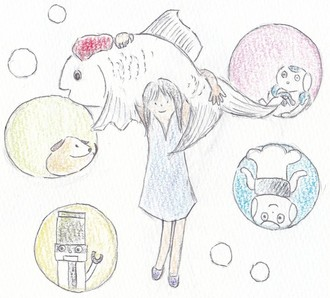

I like singing, listening to music (奏), drawing, learning art history and appreciating paintings (絵).  

# Welcome to my gallery

## Happy New Year 2015 (Three Nao Sheep)

2015 is the year of the sheep in Chinese zodiac.

## NAO HSR KOCHI PEPPER

This drawing was made based on one of my favorite songs "Can't stop" Official Music Video by Red Hot Chill Peppers. My favorite robots and I can't stop!  

## Happy New Year 2019 (Pepper x Boar x NAO)

2019 is the year of the boar in Chinese zodiac.

## L'Écume Des Robots (NAO, Pepper, HSR, Aibo)

This drawing was made based on one of my favorite books "L'Écume des jours" written by Boris Vian.

# Daily tweet (Japanese)

Twitter link is <a href="https://twitter.com/enakami_gachiko">here</a>

# Posts related to my hobbies

[Impressive movies I watched in 2018](/hobby_posts/2018-12-17-movie2018.md)  

[Hello Project Countdown Party 2018](/hobby_posts/2018-12-31-hello-project-countdown-party-2018.md)     

[Impressive movies I watched in 2019 (1)](/hobby_posts/2019-03-31-movie2019.md)

[Impressive movies I watched in 2019 (2)](/hobby_posts/2019-07-01-movie2019.md)

<a href="{{ site.baseurl }}/index.html">Back to Top Page</a>