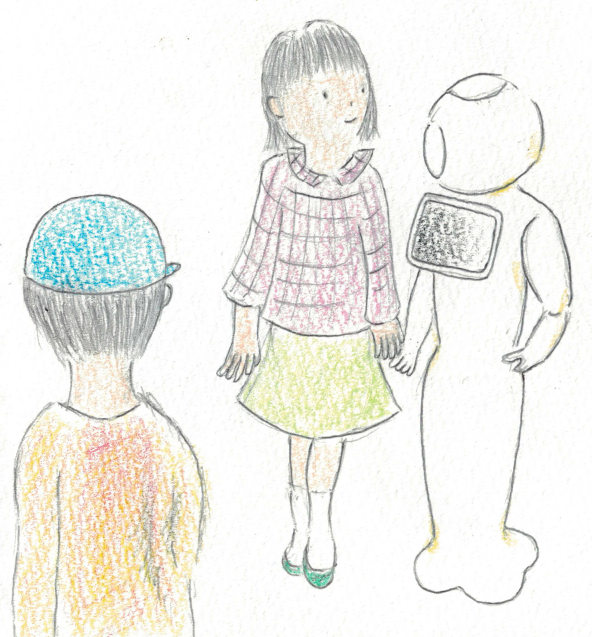
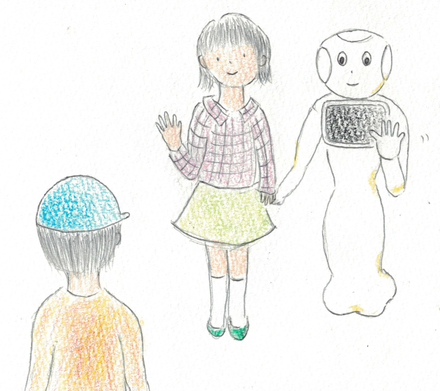
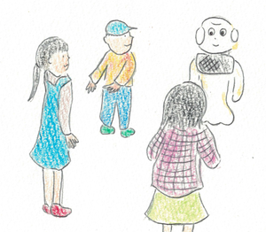
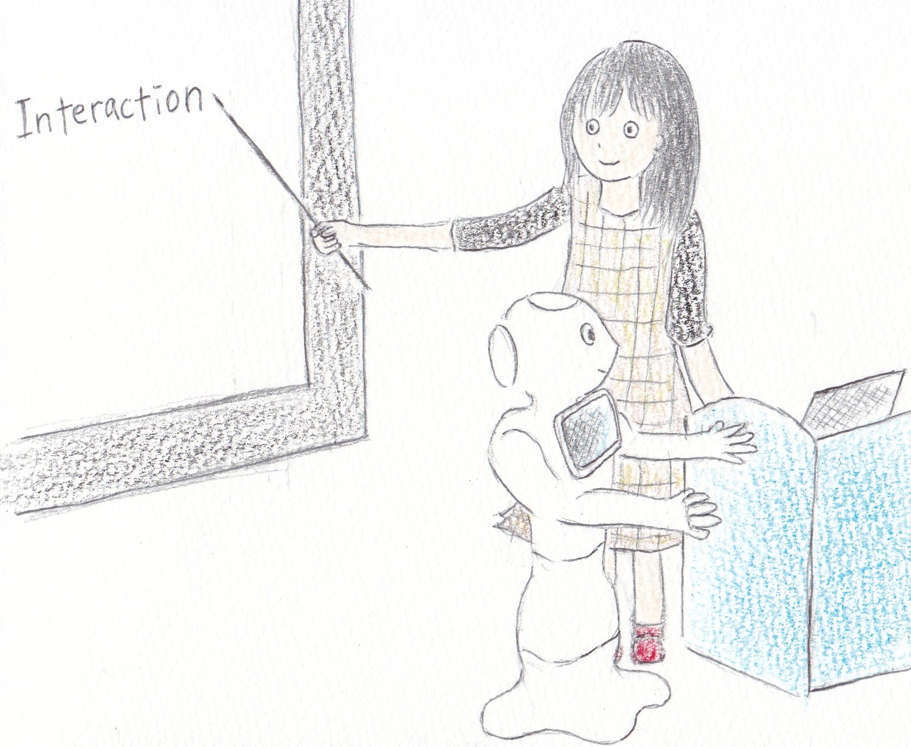

# Projects

## ロボットの周りで子どもと他者のふれ合いを生み出す
## Creating Child-People Interaction around a Robot

ロボットをコミュニケーションツールとして用い，子どもと他者のふれ合いを生み出そうとしています．

Using robots as a communication tool, we try to create communication between a child and others.

ヒューマンロボットインタラクション分野と科学コミュニケーション分野が融合した学際的な研究を行っています．

We conduct interdisciplinary research that integrates human-robot interaction field and science communication field.

ヒューマンロボットインタラクション分野では，ペッパーなどのロボットを用いて，ロボットに必要な行動をデザインしています．

In the human robot interaction field, we use a robot such as Pepper to design behaviors required for the robot.

科学コミュニケーション分野では，ヒューマンロボットインタラクションの実験と，子どもに自身の研究を伝え意見を行う活動を組み合わせた研究方法をデザインしています．

In the field of science communication, we design a research method combining human-robot interaction experiments and activities to introduce our research to children and exchange opinions with them.

### 複数の子ども同士のふれ合い創出に向けたロボットの対人距離調整能力構成法
### The configuration method of interpersonal distance adjustment ability of a robot for creating interaction among multiple children

ヒューマンロボットインタラクション分野の研究です．

This is the study in the field of human-robot interaction.

これまでの研究で，ロボットに興味があっても，他の子が既にロボットとふれ合っている場合，自分から近づくのが難しい場合があると分かってきました(注)．

Previous study (%) has shown that even if a child is interested in a robot, it may be difficult for the child to get close to the robot if other children are already interacting with the robot.

そこで，ロボットが働きかけることにより，子どもとロボットを近づけることを目指します．

Therefore, we aim at bringing a child and a robot closer by behavior of the robot.

#### ロボットと子どものふれ合いを他の子が見ている様子
#### The scene of another child sees a robot and a child

#### ロボットが働きかけを行うイメージ
#### The image of behavior of calling a child from a distance 

#### ロボットの周りで複数の子どもがふれ合い出す様子
#### The scence where multiple children interact around a robot

#### 関連論文
#### Related papers

- Walking together with a robot
  - Design and Evaluation
  [<a href="https://doi.org/10.1109/SII.2015.7405071">IEEE Xplore</a>, link to <a href="{{ site.baseurl }}/publications.html#SII2015">citation</a>]
   - Effects on Child-Child Interaction（上の注, % に対応）
   [link to <a href="{{ site.baseurl }}/publications.html#RO-MAN2018-1">citation</a>]

### 子ども・研究者のふれ合い創出（科学コミュニケーション）
### Creating child-researcher interaction (Science communication)

科学コミュニケーション分野の研究です．

This is the study in the field of science communication.

日本科学未来館において，子どもたちに自身の子ども・ロボット研究を伝え，対話を行う活動を行っています．

At Miraikan, we conduct activities to introduce our research to children and exchange opinions with them.

子どもに研究を伝える方法と，子どもからの意見を引き出す方法の２点に着目し，博物館でのイベントのデザインを行っています．

We design an event program at the museum, focusing on two points: how to convey research to children and how to ask their opinions about our study.

#### 研究紹介の様子
#### The scene of research introduction

#### 子どもとの対話の様子
#### The scene of communication between a child and a researcher

#### 関連論文
#### Related papers

- in progress
- Social Acceptance of Interactive Robots in Japan [free pdf available at ACM DL <a href="https://doi.org/10.1145/3173386.3177012">here</a>, link to <a href="{{ site.baseurl }}/publications.html#HRI2018-2">citation</a>]
- Science Communication Activities for Children [link to <a href="{{ site.baseurl }}/publications.html#RSJ2017">citation</a>]

***

### Previous Projects

#### Child-Child interaction

- Introduction of a person by a robot [link to <a href="{{ site.baseurl }}/publications.html#RO-MAN2018-2">citation</a>]

#### Child-Adult interaction

- Doing Chores with a Robot [link to <a href="{{ site.baseurl }}/publications.html#IFHE2016">citation</a>]

***

### Science Communication Activities

16. 日本科学未来館 WWFジャパン視察協力 "Introduction of Outreach Activities of Humanoid Project", 2019.02.20. 
15. 東京大学　科学技術インタープリター養成プログラム「科学技術インタープリター論I」研修 「研究者にとってのモンキーセンターの役割とは？」，2019.02.08.  
14. べてるウィンタースクール2019 研究発表「人とふれ合うロボット研究の紹介」，2019.01.16.  
13. Miraikan 「研究エリア」を一挙公開！ オープンラボ夏休みスペシャル2018，7月，2018. 
12. Miraikan オープンラボ2017・秋「フリーウォーク」, 10月, 2017.
11. 日本科学未来館サイエンティスト・クエスト, “ロボットは機械であるべきか？それとも生き物に近づくべきか？”, 2回実施, 9月, 2017.
10. Miraikan オープンラボ2017・夏「フリーウォーク」, 8月, 2017.
9. 国際家政学会アジア大会（ARAHE）ワークショップにおけるPepperデモンストレーション, 8月, 2017.
8. Miraikan 実験イベント「ロボットを目的地に連れて行こう！」, 8回実施, 10月, 11月, 2016.
7. Miraikan オープンラボ2016・秋～Incoming Reality～「フリーウォーク」, 10月, 2016.
6. Miraikan研究棟ツアー「ヒューマノイドプロジェクト」ツアー　ロボットと話してみよう！, 3回実施, 11月, 2015.
5. Miraikan オープンラボ2015「いってみよう」, 10月, 2015.
4. Miraikan研究棟ツアー「ヒューマノイドプロジェクト」ツアー　ロボットと一緒に歩いてみよう, 7月, 3回実施, 2015.
3. 東京大学駒場博物館　特別展　『境界を引く⇔ 越える』関連イベント　学生研究紹介　5月, 2015.
2. Miraikan研究棟ツアー「ヒューマノイドプロジェクト」ツアー　ロボットとコミュニケーション, 1月, 2回実施, 2015.
1. サイエンスアゴラ, 「未来館の研究棟を探検しよう！」, 11月, 2014.

### Volunteer Activities

4. Mar. 2018. HRI2018 Student Volunteers
3. Aug. 2016.  DO-IT Japan2016
2. Nov. 2015.  科学へジャンプイン東京2015
1. Apr. 2015.  東京レインボープライド

<a href="{{ site.baseurl }}/index.html">Back to Top Page</a>